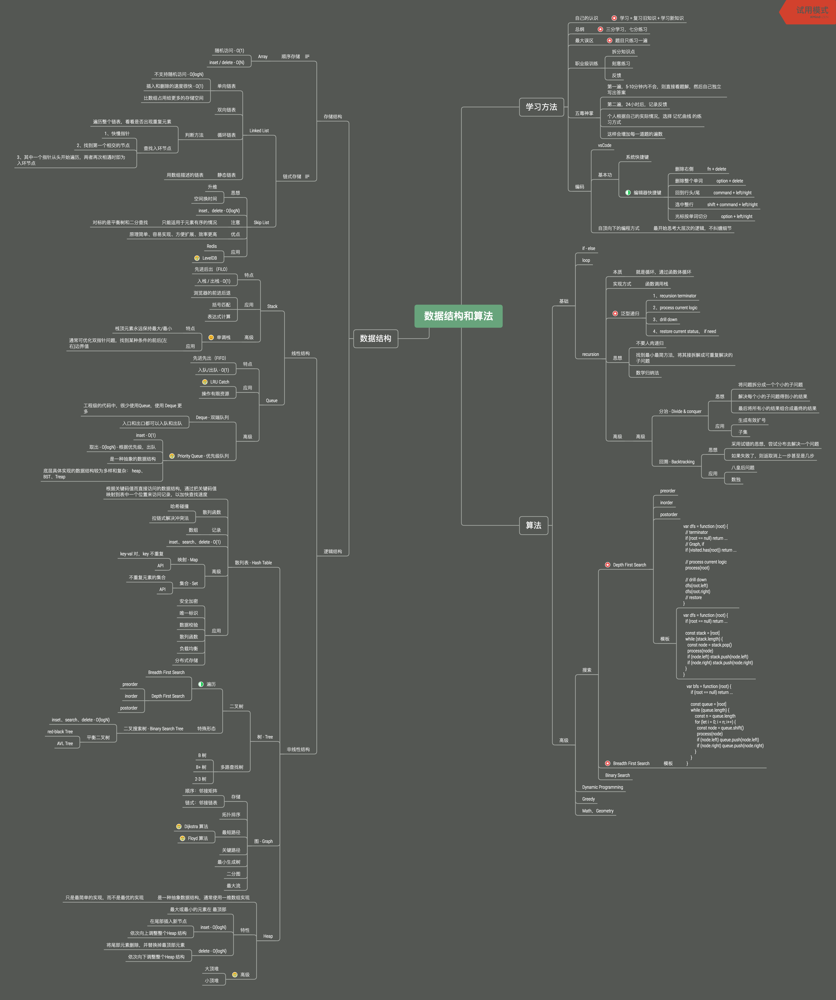

## 毕业总结

以前自己没有系统的学习过 数据结构和算法，经过本次训练营的学习，深入了解了平时经常使用的 Array、Queue、Set、Map 等常用的数据结构，也深入学习了之前并不了解的 Linked List、Tree、Binary Search Tre、red-black Tree、Heap 等以前没有使用的数据结构，现在填补自己在这一块的空白。

##### 学习最大的误区
题目只做一遍

##### 最好的学习方法
五毒神掌，通过 不断的过遍数，加深自己的映像，孰能生巧

##### 个人总结的脑图



## 数组、链表、跳表
### 数组
数组在内存是一段连续的存储空间，因此数组操作的时间复杂度为：
1. prepend - O(1)
    * 理论上是 O(n)的，但是有些数组在实现时会在头部预留一部分空间，可以直接添加元素
2. append - O(1)
3. lookup - O(1)
4. insert - O(n)
5. delete - O(n)

### 链表
为了解决在处理数据时的 insert 和 delete 的操作能更加有效，因此设计 链表的数据结构，其对应操作的时间复杂度为：
1. prepend - O(1)
2. append - O(1)
3. lookup - O(n)
4. insert - O(1)
5. delete - O(1)

### 跳表
当我们了解了数组和链表之后，明白它们其实各自是有优缺点的，为了兼容这两种数据结构的优点，因此发明了跳表这种数据结构  

跳表，其实也是一种链表，**要特别注意，只当元素在有序的情况下才可以**，为了优化访问速度，是一种insert/delete/lookup都是 O(logn)的数据结构  

实现原理：  
在原始链表的基础上，增加了多级索引，实现跳跃式查询，又因为链表元素是有序的，因此能极大减少搜索次数

## 哈希表、映射、集合
### 哈希表、映射、集合的实现与特性
**哈希表**（Hash table），也叫散列表，是根据**关键码值**（Key value）而直接进行访问的数据结构  

它通过把关键码值映射到表中一个位置来访问记录，以加快查找的速度，这个映射函数叫作散列函数（Hash Function），存放记录的数组叫作哈希表（或散列表）
#### 哈希碰撞(冲突)
是指 两个不通的值，通过 hash函数计算后得到结果相同，此时会新开一个链接来存储多个碰撞的值


## 树、二叉树、二叉搜索树的实现和特性
树 和 图的区别是什么？ **就看有没有形成环**

**Linked List 是特殊化的 Tree，Tree 是 特殊化的 Graph**

### 二叉树的遍历
```javascript
// 前序遍历
var preorder = function(root) {
  const result = []
  const helper = function (node) {
    if (node == null) return
    result.push(node.val)
    helper(node.left)
    helper(node.right)
  }
  return result
}
// 中序遍历
var preorder = function(root) {
  const result = []
  const helper = function (node) {
    if (node == null) return
    helper(node.left)
    result.push(node.val)
    helper(node.right)
  }
  return result
}
// 后序遍历
var preorder = function(root) {
  const result = []
  const helper = function (node) {
    if (node == null) return
    helper(node.left)
    helper(node.right)
    result.push(node.val)
  }
  return result
}
```

### 二叉搜索树
二叉搜索树，也称 二叉排序树，是指一颗空树 或者具有以下性质的二叉树：
1. 左子树上 **所有节点的值** 均小于它的根结点的值
2. 右子树上 **所有节点的值** 均大于它的根结点的值
3. 以此类推，左右子树也分别是 二叉搜索树

中序遍历 => 升序遍历

## 堆（Heap）
Heap： 可以迅速的找到一堆数中的最大值 或 最小值的数据结构   
将根节点最大的堆称为 大顶堆，将根节点最小的堆称为 小顶堆  
堆 其实是一种抽象的数据形式，根据实现形式可以分为 二叉堆、斐波那契堆等

### 常见 API
1. find-max: O(1) 
2. delete-max: O(logN)
3. inset(create): O(logN / O(1)
##### 性质
1. 是一颗完全树
2. 树中任意节点的值，总是 >= 其子节点的值
##### 实现
使用 一维数组，即可实现 二叉堆  
1. 根结点，即堆顶元素元素是， array[0]  
2. 索引为 i 的左孩子节点的索引是，2*i + 1
3. 索引为 i 的右孩子节点的索引是，2*i + 2
4. 索引为 i 的父节点的索引是，Math.floor((i - 1)/2)

##### 插入（insert）
1. 新元素一律插到尾部
2. 依次从 尾部向上调整整个堆的结构 (直到最顶部) （heapifyUp）

##### 删除（delete）
1. 将堆尾元素替换到顶部
2. 依次从 根部，依次向下调整整个堆的结构（直到堆尾）(heapifyDown)

**注意，二叉堆是一种堆的最常见且最简单实现，并不是最优的实现。**


## 递归
### 递归的实现、特性以及思维要点
* 递归的本质，其实就是循环，通过函数体来实现循环
* 实现方式，韩式调用栈
* 递归过程：
    * 1、recursion terminator - 递归终止条件
    * 2、process current logic - 处理当前层逻辑
    * 3、drill down - 进入下一层
    * 4、restore current status - 清除当前层状态，如果需要

#### 递归模板
```javascript
var recursion = function (level, params1, ...) {
  // recursion terminator
  if (level >= max) return ...
  // process current logic
  process(...)
  // drill down
  recursion(level + 1, ...)
  // restore current status, if need
}
```
#### 思维要点
1. 不要人肉递归
2. 寻找最小最简方法，将其拆解成可重复解决的问题（重复子问题）
3. 数学归纳法

### 分治 - Divide & conquer
* 思想
	* 将问题拆分成一个个小的子问题
	* 解决每个小的子问题得到小的结果
	* 最后将所有小的结果组合成最终的结果
  
### 回溯 - Backtracking
* 思想
	* 采用试错的思想，尝试分布去解决一个问题
	* 如果失败了，则返取消上一步甚至是几步

## 深度优先搜索（DFS） - Depth First Search
按照元素的层级深度，优先遍历最左侧、最深的节点

#### DFS 递归代码模板
```javascript
// 递归写法
var dfs = function (root) {
  // terminator
  // if (root == null) return ...
  if (visited.has(root)) return ...

  // process
  process(root)
  visted.add(root)

  // dirll down
  dfs(root.left)
  dfs(root.right)
  // restore
}

// 迭代写法
var dfs = function (root) {
  if (root == null) return []
  const result = [], visited = new Set(), stack = [root]
  visited.add(root)
  while (stack.length) {
    const node = stack.pop()
    if (visted.has(node)) continue
    result.push(node.val)
    const nodes = grentare(node)
    stack.push(nodes)
    visited.add(nodes)
  }
  return result
}
```

## 广度优先搜索(BFS) - Breadth First Search
#### 代码模板
```javascript
var bfs = function (root) {
  if (root == null) return []
  const result = [], visited = new Set(), queue = [root]
  visited.add(root)
  while (queue.length) {
    const n = queue.length, sub = []
    for (let i = 0; i < n; i++) {
      const node = queue.shift()
      sub.push(node.val)
      if (node.left) queue.push(node.left)
      if (node.right) queue.push(node.right)
    }
    result.push(sub)
  }
  return result
}
```

## Dynamic Programming
**Divide & Conquer + Optimal Substructure** => **分治 + 最优子结构**

#### 关键点
DP 和 Divide & Conquer 没有本质上的区别，都是寻找重复子问题 (就看有无最优子结构)

**共性： 找重复子问题**
**差异性： 最优子结构， 中途可以淘汰次优解** 

## 字典树 - Tire
字典树，即 Trie 树，又称 单词查找树或键树，是一种树形结构。  
典型应用是用于统计和排序大量的字符串（但不仅限于字符串），所以经常被搜索引擎系统用于文本词频统计。  

##### 优点
最大限度地减少无谓的字符串比较，查询效率比哈希表高。

#### 基本性质
1. 节点本身不存完整的单词
2. 从根结点到某一节点，路径上经过的字符链接起来，为该节点对应的字符串
3. 每个节点的所有子节点代表的字符都不相同

#### 核心思想
Tire 树的核心思想是 **空间换时间**，利用字符串的公共前缀来降低查询时间的开销已达到提高效率的目的 


## 查并集 - Disjoint Set
适用场景： **组团、配对 问题**

### 基本操作
1. makeSet(n)  
    建立一个新的并查集，其中包含 n 个元素集合
2. unionSet(x, y)  
    把元素 x 和 元素 y 所在的集合合并，要求 x，y 所在的集合不相交，如果相交则不合并
3. find(x)  
    找到元素 x 所在集合的代表，该操作也可以用来**判断两个元素是否在同一集合**

#### 并查集代码模板
```javascript
class UnionFind {
  constructor(n) {
    this.count = n
    this.parent = new Array(n)
    for (let i = 0; i < n; i++) {
      this.parent[i] = i
    }
  } 

  find (p) {
    let root = p
    while (root != this.parent[root]) {
      root = this.parent[root]
    }
    // 路径压缩
    while (this.parent[p] != p) {
      [p, this.parent[p]] = [this.parent[p], root]
      // let x = p
      // p = this.parent[x]
      // this.parent[x] = root
    }
    return root
  }

  union (p, q) {
    const rootP = this.find(p)
    const rootQ = this.find(q)
    if (rootP === rootQ) return
    this.parent[rootP] = rootQ
    this.count--
  }
}
```

## 排序方法
|排序方法|时间复杂度(平均)|时间复杂度(平均)|时间复杂度(平均)|空间复杂度|稳定性|
|:-:|:-:|:-:|:-:|:-:|:-:|
|插入排序|O(n^2)|O(n^2)|O(n)|O(1)|稳定|
|希尔排序|O(n^1.3)|O(n^2)|O(n)|O(1)|不稳定|
|选择排序|O(n^2)|O(n^2)|O(n)|O(1)|不稳定|
|堆排序|O(nlogn)|O(nlogn)|O(nlogn)|O(1)|不稳定|
|冒泡排序|O(n^2)|O(n^2)|O(nlogn)|O(1)|稳定|
|快速排序|O(nlogn)|O(nlogn)|O(nlogn)|O(1)|不稳定|
|归并排序|O(nlogn)|O(nlogn)|O(nlogn)|O(1)|稳定|
|计数排序|O(n+k)|O(n+k)|O(n+k)|O(n+k)|稳定|
|桶排序|O(n+k)|O(n^2)|O(n)|O(n+k)|稳定|
|基数排序|O(n*k)|O(n*k)|O(n*k)|O(n*k)|稳定|

