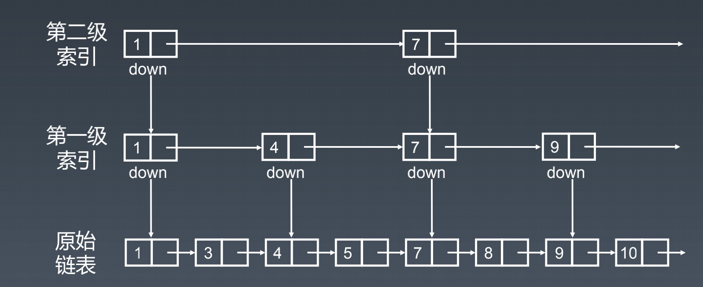

学习笔记

## 刷题置顶🔝
1. [Day1 LeetCode 283 移动零](./Day1/README.md#1)
2. [Day1 LeetCode 11 盛水最多的容器](./Day1/README.md#2)
3. [Day2 LeetCode 15 三数之和](./Day2/README.md#4)
4. [Day2 LeetCode 206 反转链表](./Day2/README.md#5)
5. [Day3 LeetCode 24 两两交换链表中的节点](./Day3/README.md#1)
6. [Day3 LeetCode 141 循环链表](./Day3/README.md#2)
7. [Day3 LeetCode 142 循环链表II - 入环节点](./Day3/README.md#3)
7. [Day4 LeetCode 20 有效的括号](./Day4/README.md#1)
8. [Day4 LeetCode 84 柱状图中最大的矩形](./Day4/README.md#2)
9. [Day5 LeetCode 21 合并两个有序链表](./Day5/README.md#1)
10. [Day5 LeetCode 239 滑动窗口最大值](./Day5/README.md#2)
10. [Day5 LeetCode 26 删除排序数组中的重复项](./Day5/README.md#3)
10. [Day5 LeetCode 88 合并两个有序数组](./Day5/README.md#4)

## 第一课数据结构与算法总览
### 个人总结的脑图
第一课预习的作业， 即 **数据结构和脑图的绘制**
  

### 刷题技巧
#### 切题四件套
1. 多看几遍题目，确保自己对这个题目的理解是正确的
2. 想所有可能的解法，比较不同解法的优劣
3. 多写，多练 (**第三步才是开始写代码**)
4. 多列举些测试用例 (注意边界值)

#### 五毒神掌
> 现在个人还不确定5遍对自己来说是否足够，因此要记录每次刷题的熟练程度，同时也为刻意练习提供参考
1. 5-10分钟中，读题+思考
2. 如果没有思路，则直接看答案或最优解
3. 24小时后，再刷一遍
4. 一周后，再刷一遍
5. 要用之前一周再刷一遍

## Day1：数组、链表、跳表
### 数组
数组在内存是一段连续的存储空间，因此数组操作的时间复杂度为：
1. prepend - O(1)
    * 理论上是 O(n)的，但是有些数组在实现时会在头部预留一部分空间，可以直接添加元素
2. append - O(1)
3. lookup - O(1)
4. insert - O(n)
5. delete - O(n)

### 链表
为了解决在处理数据时的 insert 和 delete 的操作能更加有效，因此设计 链表的数据结构，其对应操作的时间复杂度为：
1. prepend - O(1)
2. append - O(1)
3. lookup - O(n)
4. insert - O(1)
5. delete - O(1)

### 跳表
当我们了解了数组和链表之后，明白它们其实各自是有优缺点的，为了兼容这两种数据结构的优点，因此发明了跳表这种数据结构  

跳表，其实也是一种链表，**要特别注意，只当元素在有序的情况下才可以**，为了优化访问速度，是一种insert/delete/lookup都是 O(logn)的数据结构  

实现原理：  
在原始链表的基础上，增加了多级索引，实现跳跃式查询，又因为链表元素是有序的，因此能极大减少搜索次数

### 算法题的解题思路 
> 特别适合没有思虑，懵逼的时候
1. 没有思路时，首先应该考虑 **暴力求解** 的方式

2. 如果没用比较好的暴力求解的方式，或者自己想不出来，那么就尝试从最简单的问题开始
    * 如 爬楼梯的问题，就考虑 只有 1阶时，结果如何，只有2阶时，结果如何

3. 观察第二步中的最简单问题，找出 **重复子问题**

因为 计算机本身只能识别 `if-else`、`loop`、`resursion` 这些最基础的语，因此我们应该想这个方向做和思考