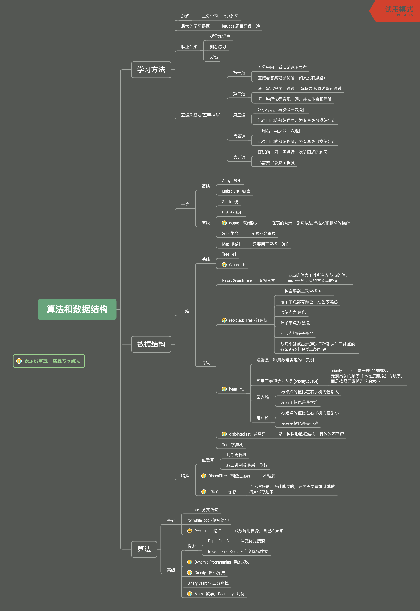

学习笔记

## 第一课数据结构与算法总览
### 个人总结的脑图
第一课预习的作业， 即 **数据结构和脑图的绘制**
  

### 刷题技巧
#### 切题四件套
1. 多看几遍题目，确保自己对这个题目的理解是正确的
2. 想所有可能的解法，比较不同解法的优劣
3. 多写，多练 (**第三步才是开始写代码**)
4. 多列举些测试用例 (注意边界值)

#### 五毒神掌
> 现在个人还不确定5遍对自己来说是否足够，因此要记录每次刷题的熟练程度，同时也为刻意练习提供参考
1. 5-10分钟中，读题+思考
2. 如果没有思路，则直接看答案或最优解
3. 24小时后，再刷一遍
4. 一周后，再刷一遍
5. 要用之前一周再刷一遍

