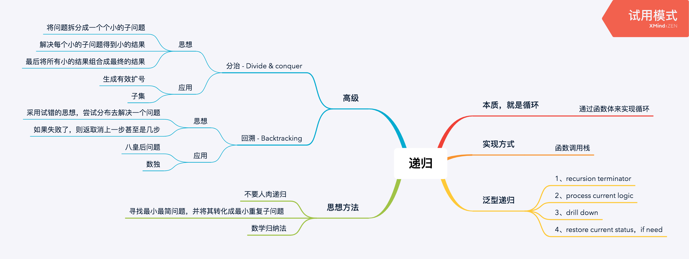
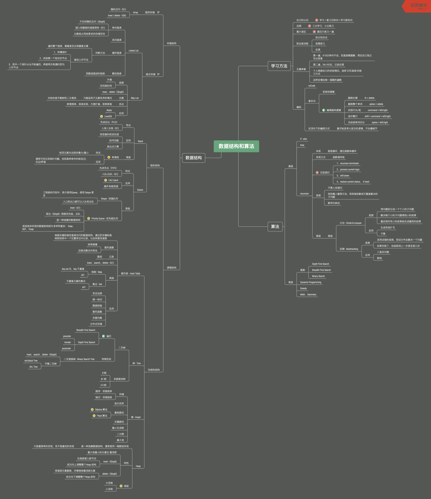

# 学习笔记

[每日一题(置顶🔝)](../questions/README.md)

## 刷题置顶🔝
* ### 递归 - 实战题目 / 课后作业
* 实战题目
    * ✅ [LeetCode 70 爬楼梯](../questions/leetcode.70.md)（阿里巴巴、腾讯、字节跳动在半年内面试常考）
    * ✅ [LeetCode 22 括号生成](./Day1/README.md#1) (字节跳动在半年内面试中考过)
    * ✅ [LeetCode 226 翻转二叉树](./Day2/README.md#1) (谷歌、字节跳动、Facebook 在半年内面试中考过)
    * ✅ [LeetCode 98 验证二叉搜索树](./Day2/README.md#2)（亚马逊、微软、Facebook 在半年内面试中考过）
    * ✅ [LeetCode 104 二叉树的最大深度](/questions/leetcode.104.md)（亚马逊、微软、字节跳动在半年内面试中考过）
    * ✅ [LeetCode 111 二叉树的最小深度](./Day2/README#3)（Facebook、字节跳动、谷歌在半年内面试中考过）
    * ❌ 二叉树的序列化与反序列化（Facebook、亚马逊在半年内面试常考）
    * ✅ [LeetCode 50 Pow(x, n)](./Day4/README.md#1) （Facebook 在半年内面试常考）
    * ✅ [LeetCode 78 子集](./Day4/README.md#2)（Facebook、字节跳动、亚马逊在半年内面试中考过）
* 每日一课
    * ✅ 如何优雅地计算斐波那契数列
* 课后作业
    * ✅ [LeetCode 236 二叉树的最近公共祖先](./Day3/README.md#1)（Facebook 在半年内面试常考）
    * ✅ [LeetCode 105 从前序与中序遍历序列构造二叉树](./Day3/README.md#2)（字节跳动、亚马逊、微软在半年内面试中考过）
    * ❌ 组合（微软、亚马逊、谷歌在半年内面试中考过）
    * ❌ 全排列（字节跳动在半年内面试常考）
    * ❌ 全排列 II （亚马逊、字节跳动、Facebook 在半年内面试中考过）

## 本周总结的思维导图


## 总的思维导图


## 递归的实现、特性以及思维要点
* 递归的本质，其实就是循环，通过函数体来实现循环
* 实现方式，韩式调用栈
* 递归过程：
    * 1、recursion terminator - 递归终止条件
    * 2、process current logic - 处理当前层逻辑
    * 3、drill down - 进入下一层
    * 4、restore current status - 清除当前层状态，如果需要

#### 递归模板
```javascript
var recursion = function (level, data, ...) {
    // terminator
    if (level > MAX) {
        return
    }
    // process current logic
    process(level, param)
    // drill down
    recursion(level + 1, newParam)
    // restore current status
}
```
#### 思维要点
1. 不要人肉递归
2. 寻找最小最简方法，将其拆解成可重复解决的问题（重复子问题）
3. 数学归纳法


### 分治 - Divide & conquer
* 思想
	* 将问题拆分成一个个小的子问题
	* 解决每个小的子问题得到小的结果
	* 最后将所有小的结果组合成最终的结果
  

### 回溯 - Backtracking
* 思想
	* 采用试错的思想，尝试分布去解决一个问题
	* 如果失败了，则返取消上一步甚至是几步
