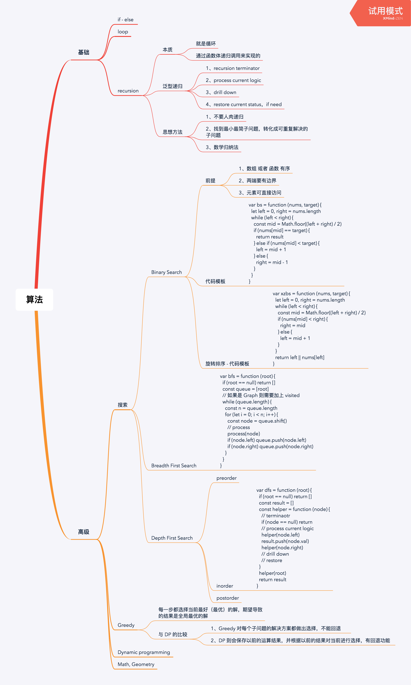
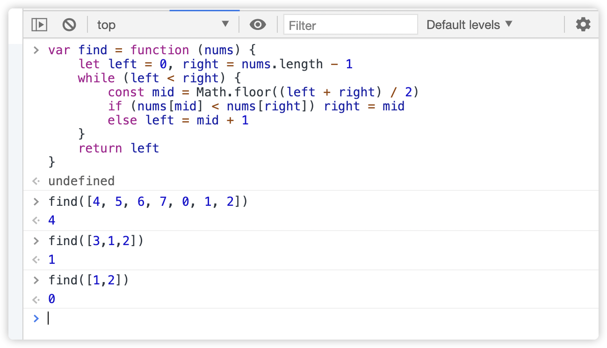

# 学习笔记

[每日一题(置顶🔝)](../questions/README.md)

## 刷题置顶🔝
* ### 递归 - 实战题目 / 课后作业
* 实战题目
    * ✅ [LeetCode 102 二叉树的层序遍历](./Day1/README.md#1)（字节跳动、亚马逊、微软在半年内面试中考过）
    * ✅ [LeetCode 433 最小基因变化](./Day4/README.md#2)
    * ✅ [LeetCode 22 括号生成](../Week_03/Day1/README.md#1)（字节跳动、亚马逊、Facebook 在半年内面试中考过）
    * ✅ [LeetCode 515 在每个树行中找最大值](./Day2/README.md#2)（微软、亚马逊、Facebook 在半年内面试中考过）
    * ✅ [LeetCode 69 x 的平方根](./Day2/README.md#1)（字节跳动、微软、亚马逊在半年内面试中考过）
    * ✅ [LeetCode 367 有效的完全平方数](./Day2/README.md#3)（亚马逊在半年内面试中考过）
* 课后作业
    * ✅ [LeetCode 127 单词接龙](./Day3/README.md#1)（亚马逊在半年内面试常考）
    * ❌ 单词接龙 II （微软、亚马逊、Facebook 在半年内面试中考过）
    * ✅ [LeetCode 200 岛屿数量](../Week_02/Day5/README.md#1)（近半年内，亚马逊在面试中考查此题达到 350 次）
    * ❌ 扫雷游戏（亚马逊、Facebook 在半年内面试中考过）
    * ✅ [LeetCode 860 柠檬水找零](../questions/leetcode.860.md)（亚马逊在半年内面试中考过）
    * ✅ [LeetCode 122 买卖股票的最佳时机](../questions/leetcode.122.md) （亚马逊、字节跳动、微软在半年内面试中考过）
    * ✅ [LeetCode 455 分发饼干](./Day4/README.md#4)（亚马逊在半年内面试中考过）
    * ✅ [LeetCode 874 模拟机器人行走](./Day5/README.md#1)
    * ✅ [LeetCode 55 跳跃游戏](./Day5/README.md#2) （亚马逊、华为、Facebook 在半年内面试中考过）
    * ❌ 跳跃游戏 II （亚马逊、华为、字节跳动在半年内面试中考过）
    * ✅ [LeetCode 33 搜索旋转排序数组](./Day6/README.md#1)（Facebook、字节跳动、亚马逊在半年内面试常考）
    * ✅ [LeetCode 74 搜索二维矩阵](./Day5/README.md#2)（亚马逊、微软、Facebook 在半年内面试中考过）
    * ✅ [LeetCode 153 寻找旋转排序数组中的最小值](./Day7/README.md#1)（亚马逊、微软、字节跳动在半年内面试中考过）
    * ✅ [使用二分查找，寻找一个半有序数组](#1) [4, 5, 6, 7, 0, 1, 2] 中间无序的地方
* 其他
  * ✅ [LeetCode 509 斐波那契数](../questions/leetcode.509.md)
  * ✅ [LeetCode 108 将有序数组转换为二叉搜索树](../questions/leetcode.509.md)

## 本周总结的思维导图


## 总的思维导图


### 第9课 深度优先搜索 和 广度优先搜索

#### 深度优先搜索（DFS） - Depth First Search

按照元素的层级深度，优先遍历最左侧、最深的节点

#### DFS 递归代码模板

```javascript
var dfs = function (root) {
    // terminator
    // if (root == null) return ...
    if (visited.has(root)) return ...

    visited.add(root)
    // process current logic
    process(root)

    // drill down
    dfs(root.left)
    dfs(root.right)

    // restore
}
```

#### DFS - 非递归遍历模板

```javascript
var dfs = function (root) {
    // terminator
    // if (root == null) return ...

    const visited = new Set()
    const stack = [root]
    visited.add(root)

    while (stack.length > 0) {
        const node = stack.pop()
        if (visited.has(node)) continue
        const nodes = grentare(node)
        stack.push(nodes)
    }
}
```


#### BFS - 代码模板

```javascript
var bfs = function (root) {
    if (root == null) return []

    const queue = [root] 
    while (queue.length > 0) {
        const n = queue.length
        for (let i = 0; i < n; i++) {
            const node = queue.shift()
            // process current logic
            const nodes = grentare(node)
            queue.push(nodes)
        }
    }
}
```

### 贪心算法 - Greedy
贪心算法是一种在每一步选择中都采取在当前状态下最好或最优（即最有利）的选择，从而希望导致结果是全局最好或最优的算法。

#### 贪心算法 与 动态规划的比较
* 不同在于它对每个子问题的解决方案都做出选择，不能回退
* 动态规划则会保存以前的运算结果，并根据以前的结果对当前进行选择，有回退功能

#### 从 (硬币)零钱兑换 中看 贪心算法
1. 当硬币可选集合固定：Coins = [20, 10, 5, 1]，求最少可以几个硬币拼出总数。 比如 total = 36

**这种条件下，可以使用贪心算法求得最后的结果，这是因为 Coins 中大的硬币是小的硬币的整数倍，也就是说选择多个小的等价于选择一个大的**

2. 非整除关系的硬币，可选集合：Coins = [10, 9, 1]，求拼出总数为 18 最少需要几个硬币？

***这种条件下，我们发现就不能使用贪心算法求解了*

##### 适用贪心算法的场景
简单地说，问题能够分解成子问题来解决，子问题的最优解能递推到最终问题的最优解，这种子问题最优解称为最优子结构。

### 二分查找
#### 二分查找的前提
1. 目标函数的单调性
2. 存在上下界 （bounded）
3. 能够通过索引访问 (index accessible)

#### 代码模板
```javascript
var bs = function (array) {
    let left = 0, right = array.length - 1
    while (left <= right) {
        const mid = Math.floor((left + right) / 2)
        if (array[mid] == target) {
            // find the target
            break || return result
        } else if (array[mid] < target) {
            left = mid + 1
        } else {
            right = mid - 1
        }
    }
}
```

##### 牛顿迭代法的公式： x = (x + a / x) / 2


##### 作业
1. 使用二分查找的方式(O(logN))找出 旋转排序数组的旋转位置

##### 旋转排序数组 与 排序数组的却别：
* 相同点：
    * 都可以直接套用 二分法代码模板
* 不同点
    * 排序数组的二分法判断条件是 mid 与 target 比较
    * 旋转排序数组的二分法判断条件是 mid 与 right 比较，确定最小值可能存在的位置

```javascript
var find = function (nums) {
    if (nums.length < 2) return 0
    let left = 0, right = nums.lenght - 1

    while (left < right) {
        const mid = Math.floor((left + right) / 2)
        // mid 可能是最小值
        if (nums[mid] < nums[right]) {
            right = mid
        // mid 一定不是最小值
        } else {
            left = mid + 1
        }
    }
    return left || nums[left]
}
```

<h2 id='1'>使用二分查找，寻找一个半有序数组 [4, 5, 6, 7, 0, 1, 2] 中间无序的地方</h2>

```javascript
var find = function (nums) {
    let left = 0, right = nums.length - 1
    while (left < right) {
        const mid = Math.floor((left + right) / 2)
        if (nums[mid] < nums[right]) right = mid
        else left = mid + 1
    }
    return left
}
```

