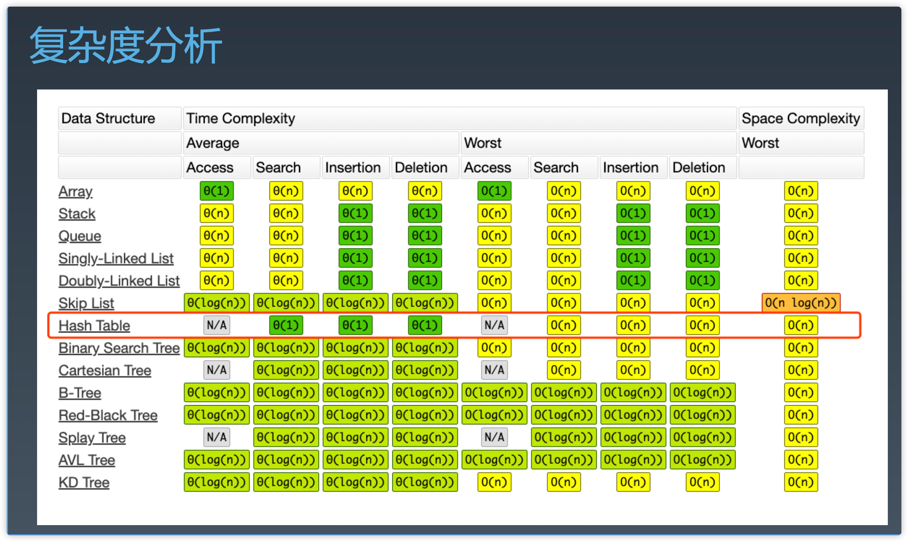

# 第二周复习

## 第五课 哈希表、映射、集合
### 哈希表
哈希表(Hash table)，也叫散列表，是根据关键码值(Key value )而直接进行访问的数据结构

#### 散列函数
* 碰撞
* 拉链式解决冲突法



实战题：
1. ✅ 有效的字母异位词（loop + hash）
2. ✅ 字母异位词分组（loop + hash） => Object.values
3. ✅ 两数之和（loop + hash）

## 第六课 树、二叉树、二叉搜索树
Linked List 是特殊化的树，树 是特殊化的 图

#### 二叉树遍历
1. Breadth First Search 代码模板
```javascript
var bfs = function (root) {
  if (root == null) return []
  const result = []
  const queue = [root]
  while (queue.length) {
    const n = queue.length
    const sub = []
    for (let i = 0; i < n; i++) {
      const node = queue.shift()
      sub.push(node.val)
      if (node.left) queue.push(node.left)
      if (node.right) queue.push(node.right)
    }
    result.push(sub)
  }
  return result
}
```
```javascript
// BFS 变形代码模板
var bfs = function (root) {
  if (root == null) return []
  const result = []
  const queue = [[root, 0]]
  while (queue.length) {
    const [node, level] = queue.shift()
    result[level] = result[level] === undefined ? [] : result[level]
    result[level].push(node.val)
    if (node.left) queue.push(node.left)
    if (node.right) queue.push(node.right)
  }
  return result
}
```

2. Depth First Search  代码模板
  * 前序遍历 - preorder
  * 中序遍历 - inorder
  * 后续遍历 - postorder

```javascript 
// inorder
var dfs = function (root) {
  if (root == null) return []
  const result = []
  const helper = function (node) {
    // terminaotr
    if (node == null) return
    // process current logic
    // drill down
    helper(node.left)
    result.push(node.val)
    helper(node.right)
    // restore
  }
  return result
}
```
```javascript
// 非递归方式
var dfs = function (root) {
  if (root == null) return []
  const result = []
  const stack = []
  let curr = head
  while (curr !== null || stack.length) {
    if (curr !== null) {
      stack.push(curr)
      curr = curr.left
    } else {
      const node = stack.pop()
      result.push(node.val)
      curr = curr.right
    }
  }
  return result
}
```

#### 二叉搜索树 - Binary Search Tree
##### 常见操作
1. 查询 - O(logN)
2. 插入 - O(logN)
3. 删除 - O(logN)
  * 找到删除节点右侧最小的节点（或左侧最大的节点）提升到当前节点的位置，并删除当前节点

**注意：BST 的中序遍历结果是升序的。**

实战题：
1. ✅ 二叉树的中序遍历（亚马逊、微软、字节跳动在半年内面试中考过）
2. ✅ 二叉树的前序遍历（谷歌、微软、字节跳动在半年内面试中考过）
3. ✅ N 叉树的后序遍历（亚马逊在半年内面试中考过）
4. ✅ N 叉树的前序遍历（亚马逊在半年内面试中考过）
5. ✅ N 叉树的层序遍历


